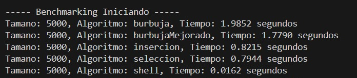
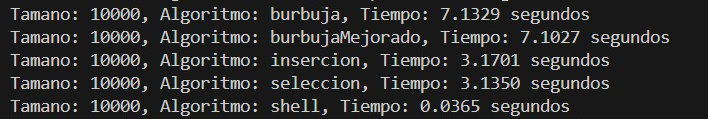
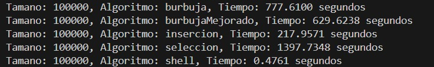
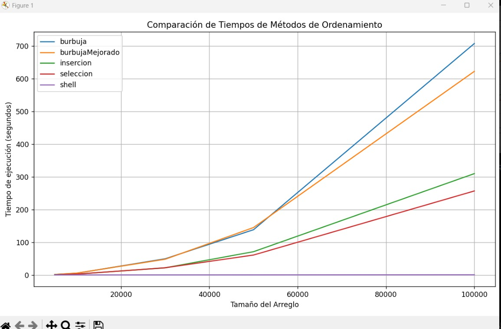

<h1 align="center"> Algoritmos de Ordenamiento  </h1>

 - Carrera : Computación
 - Asignatura: Estructura de Datos
 - Estudiantes : Keyra Carvajal - Diana Borja
 - Objetivos: 
    - Relacionar las técnicas de Ordenamiento.
    - Desarrollar módulos que emplean técnicas de Ordenamiento.
## Introduccion 🔧

Este proyecto tiene como finalidad evaluar la eficiencia temporal de los diferentes algoritmos de ordenamiento - (Método Burbuja con ajuste, Selección e Inserción). A medida que se realiza las mediciones de tiempo también se generán gráficas que representan el mátodo y su tiempo de ejecución.  

## Implementación 🔧
Este programa esta estructurado en 4 archivos .py, los cuales son:
- app.py
- benchmarking.py
- grafico.py
- sortMethods.py

 En el archivo app.py tenemos el menu que llama a todos los métodos, asi como tambien el tamaño del arreglo que se ordenará con los diferentes métodos implementados.

El archivo benchmarking.py nos sirve como herramienta para hacer pruebas de rendimiento (benchmark) sobre los algoritmos de ordenamiento.

El archivo grafico.py nos sirve como ejemplo básico para crear una gráfica con Matplotlib

El archivo sortMethods.py nos sirve para crear todos los métodos de ordenamiento junto con todas sus condiciones correspondientes para que se ejecute de manera correcta los mismos.

## Resultados Obtenidos🔧

### 1.- Métodos de Ordenamiento en un arreglo de 5000

### 2.- Métodos de Ordenamiento en un arreglo de 10.000

### 3.- Métodos de Ordenamiento en un arreglo de 30.000

### 4.- Métodos de Ordenamiento en un arreglo de 50.000

### 5.- Métodos de Ordenamiento en un arreglo de 100.000

## Gráfica  -  Métodos de Ordenamiento 🔧

##  Conclusiones con Terminología de Notación - Diana Borja

-  Al hacer un recorrido con diferentes tamaños de arreglos, la afeccion de la complejidad temporal se refleja notoriamente en los algoritmos de ordenamiento. Los resultados obtenidos muestran que Burbuja, Burbuja Mejorado, Inserción y Selección tienen una onda de \(O(n^2)\), ya que el tiempo de ejecución se incrementa de forma drástica con el aumento del tamaño del arreglo. Por otro lado el método Shell tiene un aumento mucho mas gradual del tiempo de ejecución al incrementar el tamaño del arreglo lo que demuestra una complejidad subcuadrática.

##  Conclusiones con Terminología de Notación - Keyra Carvajal
Al probar diferentes algoritmos con arreglos de distintos tamaños, se nota claramente cómo la eficiencia cambia según la complejidad de cada uno. Los métodos Burbuja, Burbuja Mejorado, Inserción y Selección tardan mucho más a medida que el arreglo crece, lo cual tiene sentido porque su complejidad es O(n2)O(n^2)O(n2). En cambio, el método Shell mostró un crecimiento de tiempo más lento y controlado, lo que indica que es más eficiente y tiene una complejidad menor. Esto demuestra que, para trabajar con muchos datos, es mejor usar algoritmos como Shell que no se ven tan afectados por el tamaño del arreglo.

## Enlace del Repositorio 
[Enlace GitHub](https://github.com/KeyraCarvajajl/icc-est-U1-Teor-aComplejidad.git)

